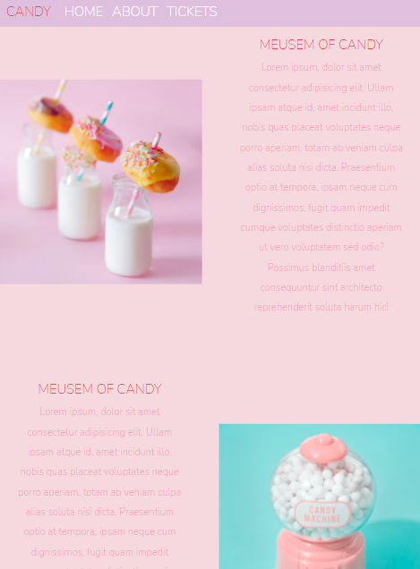
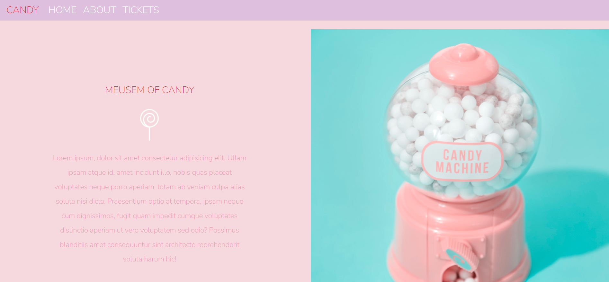
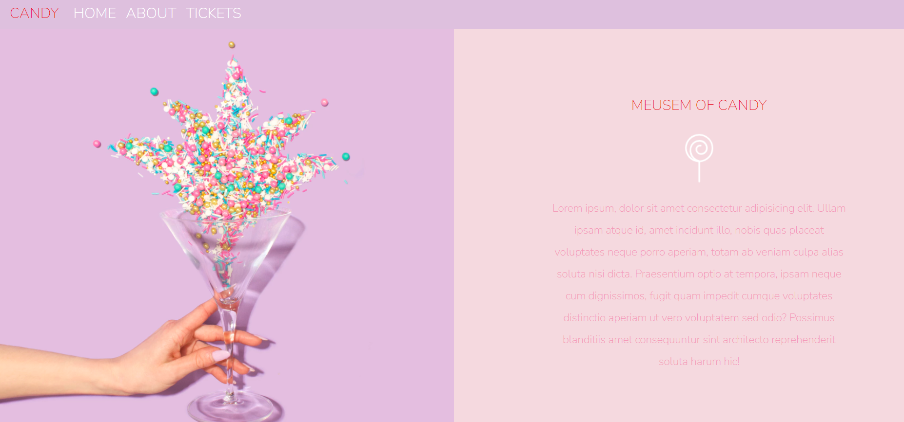
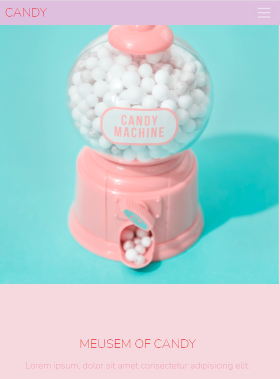

 # Front-end Project(MEUSEUM OF CANDY)

 ## Welcome!

 ##let's get started.

 Thank you for checking this work.

 ## About This Work:
   This is a Candy website, which is showcasing different types of designd patterns and proper usage of background colors in CSS. Firstly this Work was built with Bootstrap(A CSS FRAME-WORK), which was used to ensure optimum speed for the output of this project.

## pictures of this Work
 ##An Example##
 

 ##process##

     THIS FILE IS FOR THE PRACTISE OF CSS AND BOOTSTRAP
 -PRACTISED USING GRIDS TO YIELD ADEQUATE LAYOUTS OF IMAGES AND TEXTS.
 -USED FLEXBOX TO CONTROL THE DISPLAY PATTERN.
 -USED THE WIDTH AD HEIGHT PROPERTIES TO ENSURE PROPER RESIZING OF IMAGES.
 -USED THE QUERY PROPERTIES(MEDIA) IN ENSURING SMOOTH LAYOUT WITH ALL CHECKPOINTS BEING MET.
 -PRACTICED PROPER BLENDING OF IMAGES WITH THE BACKGROUND COLOR TO IMPROVE THE BEAUTY OF THE PAGE.
 -IT'S ALSO VERY RESPONSVE...

##DIFFERENT SCREEN SIZES

 ##Larger screen sizes##

 ##smaller screen sizes##

  ## Built with         
      -HTML(Hypertext Mark-up Language)
      -CSS(Cascading Styles Sheet)
      -BOOTSTRAP

  ## My Challanges and lessons
   Learnt how to re-size pictures with percentages firstly. Practised using of Bootstrap for the grids, (quite easy to get a grip of) to ensure effective layout of sections in the project.

   

   ## Installations
   -For those Farmiliar with Git-hub you can clone the repo and pull to your local workplace to view.

   -For those who want to view you can click the link to view the file from here [https://jmp.sh/NyvRBnZ], Thank you once again.
  

   ## Best syntax Used

    ``CSS
   (Grids), (flex-box), and (power of proper font usage).
  Grid property was used to ensure organized and beautiful layout of images and texts, with the flex-box to avoid dis-mantle of sections and our all underrated font usage.
   ``

   ## Resources that helped ##
   -For the Colors[https://htmlcolorcodes.com/color-names/]

   -For the icons[https://fontawesome.com/v5.15/icons/instagram?style=brands] and svg's in the folder.

  -For the images[https://unsplash.com/]

  -For the fonts[https://fonts.google.com/?sort=popularity&query=qui]

 ## Licsense 
   This work is under [MIT] liscence. It's highly free and opensource to anyone.
